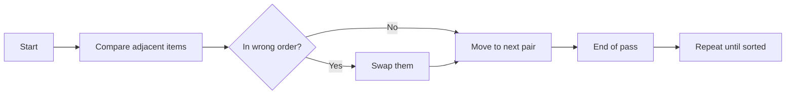

# Bubble Sort Algorithm

Bubble sort repeatedly compares adjacent elements and swaps them when they are in the wrong order. After each pass, the largest unsorted element moves to its correct position at the end of the list.

It is an in-place, stable sorting algorithm with $O(n^2)$ worst/average case time complexity, $O(n)$ best case time complexity (when optimized with a swap flag), and $O(1)$ extra space.

Example:

- Input: `[5, 1, 4, 2, 8]`
- Output: `[1, 2, 4, 5, 8]`



Python Code:
```python
class Solution:
    def bubbleSort(self, nums: list[int]) -> list[int]:
        n = len(nums)

        for i in range(n):
            swapped = False
            for j in range(0, n - i - 1):
                if nums[j] > nums[j + 1]:
                    nums[j], nums[j + 1] = nums[j + 1], nums[j]
                    swapped = True
            
            # If no elements were swapped in this pass, array is already sorted
            if not swapped:
                break

        return nums
```