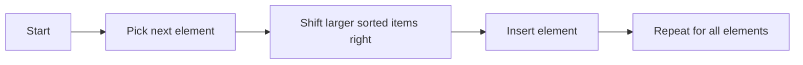

# Insertion Sort Algorithm

Insertion sort builds the sorted part of the list one element at a time by taking the current value and inserting it into the correct position among the already sorted elements.

It is an in-place algorithm with $O(n^2)$ time complexity in the average and worst case, and $O(1)$ extra space.

Example:

- Input: [7, 3, 5, 2]
- Output: [2, 3, 5, 7]



Python Code:
```python
class Solution:
    def insertionSort(self, nums):
        n = len(nums)

        for i in range(1, n):
            key = nums[i]
            j = i - 1

            while j >= 0 and nums[j] > key:
                nums[j + 1] = nums[j]
                j -= 1

            nums[j + 1] = key

        return nums
```