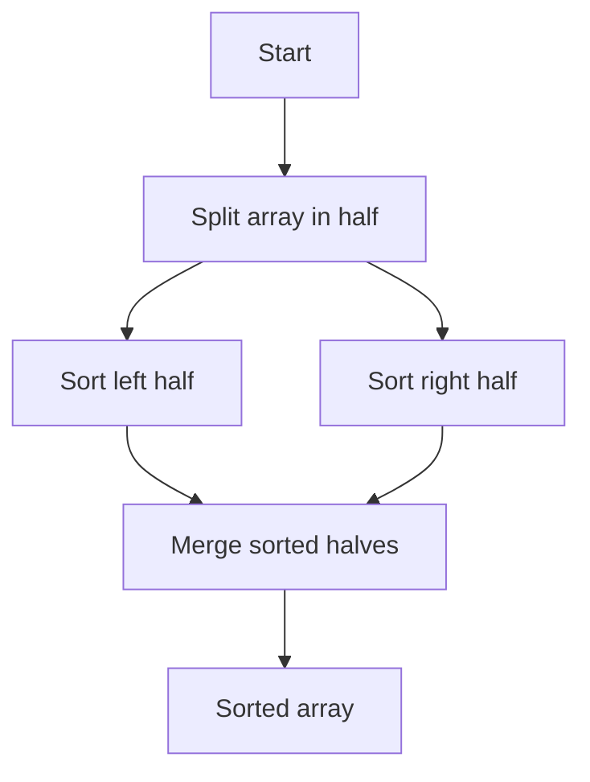

# Merge Sort Algorithm

Merge sort uses divide and conquer: it splits the list into two halves, sorts each half recursively, and then merges the sorted halves back together.

It has $O(n \log n)$ time complexity and uses $O(n)$ extra space for merging.

Example:

- Input: [8, 3, 5, 4, 7, 6, 1, 2]
- Output: [1, 2, 3, 4, 5, 6, 7, 8]



Python Code:
```python
class Solution:
    def mergeSort(self, nums):
        if len(nums) <= 1:
            return nums

        mid = len(nums) // 2
        left = self.mergeSort(nums[:mid])
        right = self.mergeSort(nums[mid:])

        return self.merge(left, right)

    def merge(self, left, right):
        merged = []
        i = j = 0

        while i < len(left) and j < len(right):
            if left[i] <= right[j]:
                merged.append(left[i])
                i += 1
            else:
                merged.append(right[j])
                j += 1

        merged.extend(left[i:])
        merged.extend(right[j:])
        return merged
```