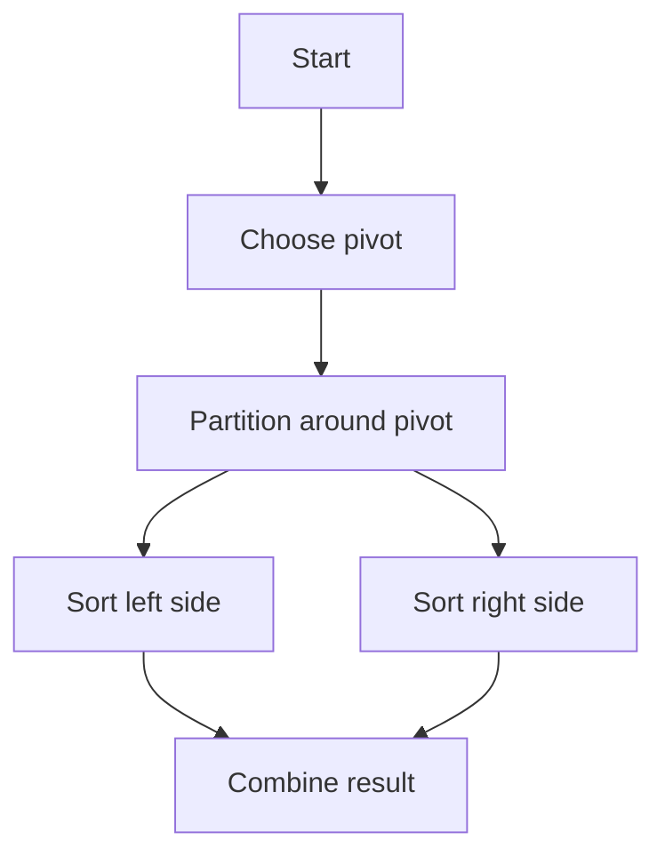

# Quick Sort Algorithm

Quick sort uses divide and conquer. It chooses a pivot, partitions the list so smaller elements go to the left and larger elements go to the right, and then recursively sorts both sides.

It has $O(n \log n)$ average time complexity, $O(n^2)$ worst-case time complexity, and $O(\log n)$ recursion space.

Example:

- Input: `[10, 7, 8, 9, 1, 5]`
- Output: `[1, 5, 7, 8, 9, 10]`



Python Code:
```python
class Solution:
    def quickSort(self, nums: list[int]) -> list[int]:
        self._quick_sort_helper(nums, 0, len(nums) - 1)
        return nums

    def _quick_sort_helper(self, nums: list[int], low: int, high: int) -> None:
        if low < high:
            pivot_index = self._partition(nums, low, high)
            self._quick_sort_helper(nums, low, pivot_index - 1)
            self._quick_sort_helper(nums, pivot_index + 1, high)

    def _partition(self, nums: list[int], low: int, high: int) -> int:
        pivot = nums[high]
        i = low - 1

        for j in range(low, high):
            if nums[j] <= pivot:
                i += 1
                nums[i], nums[j] = nums[j], nums[i]

        nums[i + 1], nums[high] = nums[high], nums[i + 1]
        return i + 1
```