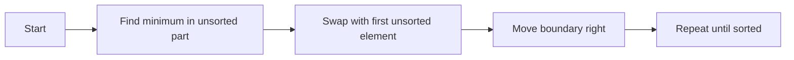

# Selection Sort Algorithm

Selection sort repeatedly picks the smallest value from the unsorted portion of the list and swaps it into the next sorted position.

It is an in-place, unstable algorithm with $O(n^2)$ time complexity across all cases and $O(1)$ extra space.

Example:

- Input: `[64, 25, 12, 22, 11]`
- Output: `[11, 12, 22, 25, 64]`



Python Code:
```python
class Solution:
    def selectionSort(self, nums: list[int]) -> list[int]:
        n = len(nums)

        for i in range(n - 1):
            min_index = i
            for j in range(i + 1, n):
                if nums[j] < nums[min_index]:
                    min_index = j

            if min_index != i:
                nums[i], nums[min_index] = nums[min_index], nums[i]

        return nums
```