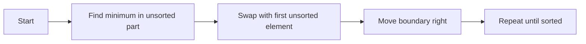

# Selection Sort Algorithm

Selection sort repeatedly picks the smallest value from the unsorted portion of the list and swaps it into the next sorted position.

It is an in-place algorithm with $O(n^2)$ time complexity and $O(1)$ extra space.

Example:

- Input: [64, 25, 12, 22, 11]
- Output: [11, 12, 22, 25, 64]



Python Code:
```python
class Solution:
    def selection_sort(self, nums: list) -> None:
        n = len(nums)

        for i in range(n - 1):
            index = i
            for j in range(i + 1, n):
                if nums[j] < nums[index]:
                    index = j

            if index != i:
                nums[index], nums[i] = nums[i], nums[index]

def main():
    sol = Solution()
    nums = [7, 4, 1, 5, 3]
    sol.selection_sort(nums)

    print("After sorting: ", nums)

#   driver code for the program
if __name__ == '__main__':
    main()

```